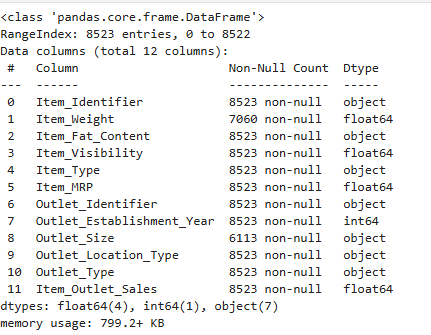
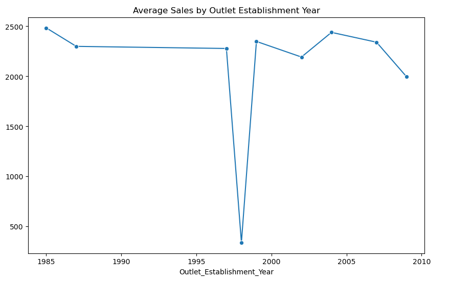
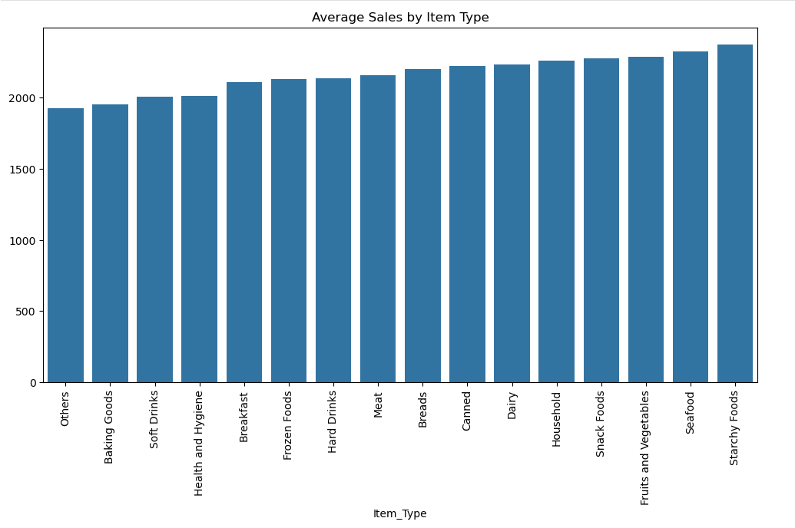
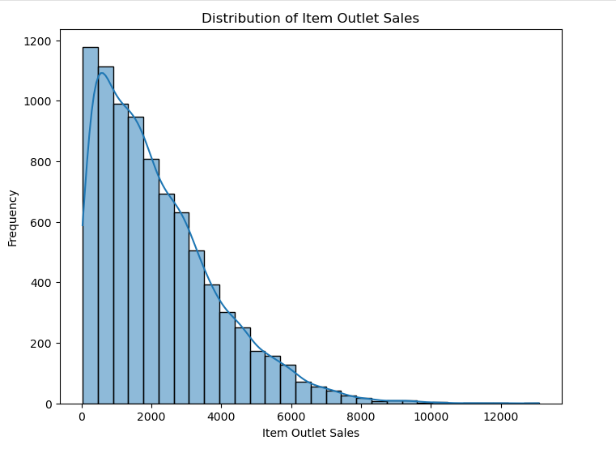
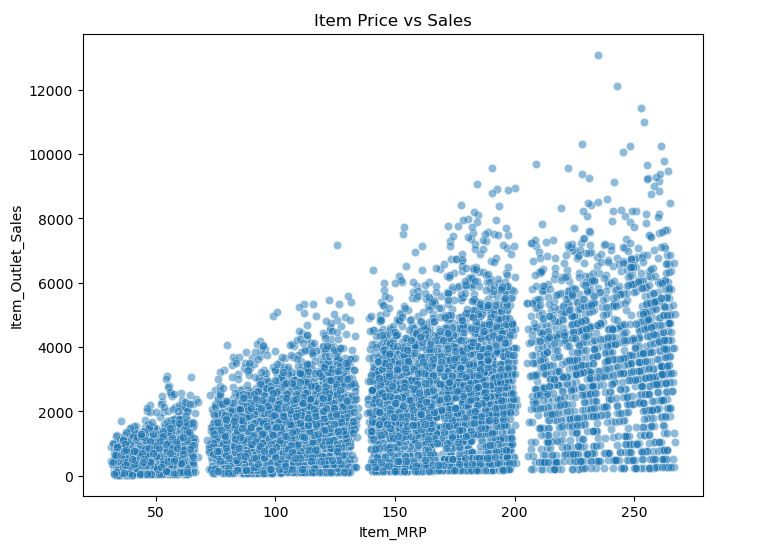

# Assignment 7 - Data Analysis and Visualization

This project demonstrates loading, analyzing, and visualizing a dataset using **Python (pandas, matplotlib, seaborn)**. The dataset was obtained from kaggle.com.

---

## Task 1: Load and Explore the Dataset
- Chose a sales dataset in CSV format.
- Loaded the dataset using `pandas`.
- Inspected the first few rows with `.head()`.

### Sample of the Dataset

- Checked datatypes and missing values using `.info()`.

### Dataset Information

- Cleaned the dataset by filling/dropping missing values.
- Explored basic statistics with `.describe()`.

### Dataset Statistics

---

## Task 2: Basic Data Analysis
- Computed summary statistics (`mean`, `median`, `std`) using `.describe()`.
- Grouped by a categorical column (e.g., `Item_Type`) and calculated the mean sales.
- Key insight: Certain product categories and outlet types consistently perform better in sales.

---

## Task 3: Data Visualization

### 1. Line Chart – Sales Trend Over Time

### 2. Bar Chart – Average Sales by Item Type

### 3. Histogram – Distribution of Item Outlet Sales

### 4. Scatter Plot – Item MRP vs Sales

---

## Conclusion
- The dataset showed clear patterns where certain outlet types outperform others.
- Item pricing (`Item_MRP`) strongly influences sales, with distinct clusters of high-performing price bands.
- Visualization helped uncover hidden trends that were not obvious from raw data.
